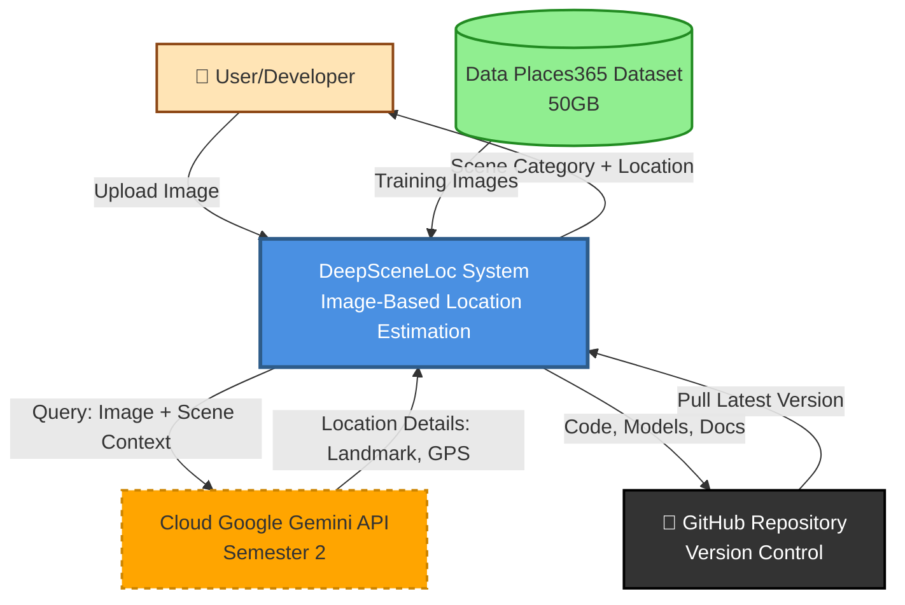

# DFD Level 0 - Context Diagram
## DeepSceneLoc System Overview

## System Inputs
- **User Images:** JPG, PNG, JPEG formats
- **Training Dataset:** Places365 outdoor scenes (5 categories)
- **Pretrained Weights:** ImageNet ResNet-50
- **Configuration:** YAML files, hyperparameters

## System Outputs
- **Stage 1 (Semester 1):** Scene category (Coastal/Forest/Mountain/Rural/Urban) + confidence scores
- **Stage 2 (Semester 2):** Exact location (landmark name, city, country, GPS coordinates)
- **Development Outputs:** Trained models, evaluation metrics, checkpoints

## External Entities
1. **User/Developer:** Provides images, receives predictions, monitors training
2. **Places365 Dataset:** Source of training/validation/test images
3. **Google Gemini API:** AI service for exact location detection (Semester 2)
4. **GitHub Repository:** Code versioning and collaboration

## Data Flows
- **Bidirectional:** User ↔ System (image upload, results display)
- **Unidirectional:** Dataset → System (training data)
- **Unidirectional:** System → Gemini API → System (location queries)
- **Bidirectional:** System ↔ GitHub (version control)
