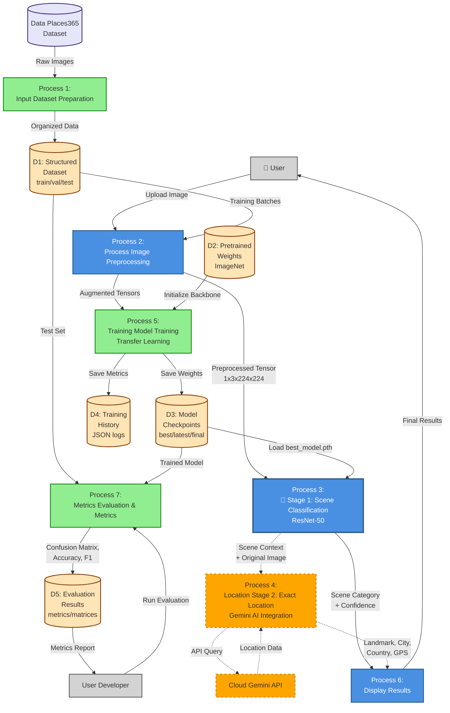

# DFD Level 1 - Main System Processes
## DeepSceneLoc: Complete Processing Pipeline

---

## Process Descriptions

### **Process 1: Dataset Preparation** (Week 3 - Complete [OK])
**Input:** Raw images from Places365  
**Processing:**
- Download 50GB dataset
- Verify file integrity (check for corruption)
- Validate category distribution
- Split: 70% train, 15% validation, 15% test
- Organize into folder structure

**Output:** Structured dataset in `data/places365/`  
**Data Store:** D1 (Structured Dataset)

---

### **Process 2: Image Preprocessing** (Week 4 - Complete [OK])
**Input:** Raw image (from User OR Dataset)  
**Processing:**
- Validate format (JPG/PNG/JPEG only)
- Check minimum dimensions
- Resize to 224×224 pixels
- Normalize using ImageNet statistics (mean=[0.485, 0.456, 0.406], std=[0.229, 0.224, 0.225])
- Apply augmentation (training only): random flip, rotation, color jitter
- Convert to PyTorch tensor

**Output:** Preprocessed tensor (shape: 1×3×224×224)  
**Note:** Same preprocessing for both training and inference

---

### **Process 3: Stage 1 - Scene Classification** (Week 5 - Infrastructure Complete [OK])
**Input:** Preprocessed tensor  
**Processing:**
- Load ResNet-50 with custom classification head
- Forward pass through network
- 2048 → 512 → 5 class outputs
- Apply softmax for probabilities
- Validate confidence scores
- Extract top-3 predictions

**Output:** 
- Primary scene category: Coastal/Forest/Mountain/Rural/Urban
- Confidence scores (0-1 range)
- Top-3 predictions with percentages

**Data Store Used:** D3 (best_model.pth)  
**Status:** Demo running, full training in Week 6

---

### **Process 4: Stage 2 - Exact Location Detection** (Weeks 11-13 - Planned ⏳)
**Input:** 
- Original image
- Scene category from Stage 1 (provides context)

**Processing:**
- Prepare Gemini API request with scene context
- Send image + category to Google Gemini Vision API
- Parse location response
- Validate GPS coordinates format
- Handle API errors/retries

**Output:**
- Landmark name (e.g., "Eiffel Tower")
- City, Country (e.g., "Paris, France")
- GPS coordinates (e.g., "48.8584°N, 2.2945°E")
- Confidence/accuracy radius

**External Entity:** Google Gemini API  
**Status:** Semester 2 implementation (dashed lines)

---

### **Process 5: Model Training** (Week 5-6)
**Input:**
- Training batches from D1 (preprocessed)
- Pretrained ImageNet weights from D2

**Processing:**
- Initialize ResNet-50 backbone (frozen layers 1-3)
- Load custom classification head (trainable)
- Transfer learning approach
- Forward pass → Calculate loss (CrossEntropy)
- Backpropagation
- Optimizer step (Adam, lr=0.001)
- Learning rate scheduling (StepLR)
- Checkpoint management:
  - `best_model.pth` (highest val accuracy)
  - `latest_model.pth` (most recent epoch)
  - `final_model.pth` (after all epochs)
- Early stopping logic (patience=5 epochs)

**Output:**
- Trained model weights → D3
- Training history (loss, accuracy per epoch) → D4

**Status:** Infrastructure complete [OK], training execution in Week 6

---

### **Process 6: Display Results** (Complete [OK])
**Input:**
- Stage 1: Scene category + confidence
- Stage 2: Location details (future)

**Processing:**
- Format results for user interface
- Generate visualization (if applicable)
- Display confidence percentages
- Handle error messages

**Output:** User-friendly results display (Gradio UI)

---

### **Process 7: Evaluation & Metrics** (Week 7 - Planned)
**Input:**
- Trained model from D3
- Test set from D1
- Predictions vs. ground truth

**Processing:**
- Run inference on full test set
- Calculate metrics:
  - Overall accuracy
  - Per-class precision, recall, F1-score
  - Confusion matrix (5×5)
- Identify misclassifications
- Error analysis

**Output:**
- Evaluation report → D5
- Confusion matrix visualization
- Metrics comparison table

**Status:** Infrastructure ready, execution after training complete

---

## Data Store Details

| ID | Name | Contents | Size | Status |
|----|------|----------|------|--------|
| **D1** | Structured Dataset | Places365 images (train/val/test splits) | ~50GB | [OK] Complete |
| **D2** | Pretrained Weights | ImageNet ResNet-50 weights | ~100MB | [OK] Available |
| **D3** | Model Checkpoints | best/latest/final model files | ~100MB each | ⏳ After training |
| **D4** | Training History | JSON logs with loss/accuracy curves | ~1-5KB | ⏳ After training |
| **D5** | Evaluation Results | Metrics, confusion matrices, reports | ~10-50MB | ⏳ Week 7 |

---

## Color Legend

- 🔵 **Blue (Solid):** Runtime processes (Semester 1 - Working/Complete)
- 🟢 **Green (Solid):** Development/Training processes (In progress)
- 🟠 **Orange (Dashed):** Future implementation (Semester 2)
- 🟤 **Tan Cylinders:** Data stores (persistent storage)
- ⚫ **Gray Rectangles:** External entities (users, systems)

---

## Data Flow Summary

### **Runtime Flow (User Inference):**
User Image → Preprocessing → Stage 1 Classification → Stage 2 Location → Display Results

### **Training Flow (Development):**
Places365 → Dataset Prep → Preprocessing → Model Training → Checkpoints → Ready for Inference

### **Evaluation Flow:**
Test Set + Trained Model → Evaluation Process → Metrics & Reports

---

## Validation Points (Diamond Decision Nodes)

1. **Image Format Check:** Valid JPG/PNG/JPEG? → YES (continue) / NO (reject)
2. **Dimension Check:** Minimum size met? → YES (resize) / NO (reject)
3. **Tensor Validation:** Shape correct? → YES (forward pass) / NO (error)
4. **Confidence Threshold:** Score > 0.5? → YES (display) / NO (show "uncertain")
5. **API Response:** Gemini success? → YES (parse) / NO (retry/fallback)

These can be added as separate decision nodes in more detailed Level 2 DFDs.
