# DFD Level 2 - Stage 1 Scene Classification (Detailed)
## Process 3 Decomposition: ResNet-50 Classification Pipeline

```mermaid
graph TB
    %% Input
    Input[Preprocessed Tensor<br/>from Process 2<br/>Shape: 1x3x224x224]
    
    %% Subprocesses with validation
    P3_1[Process 3.1:<br/>🔍 Validate Input Tensor]
    D1{Valid Shape?<br/>1x3x224x224}
    P3_2[Process 3.2:<br/>📦 Load Model Architecture]
    P3_3[Process 3.3:<br/>⚙️ Load Checkpoint Weights]
    D2{Checkpoint<br/>Exists?}
    P3_4[Process 3.4:<br/>🧮 Forward Pass<br/>Backbone + Head]
    P3_5[Process 3.5:<br/>📊 Apply Softmax]
    D3{Probabilities<br/>Sum = 1.0?}
    P3_6[Process 3.6:<br/>🎯 Extract Top-3 Predictions]
    P3_7[Process 3.7:<br/>✅ Confidence Validation]
    D4{Confidence<br/>> Threshold?}
    P3_8[Process 3.8:<br/>📤 Format Output]
    
    %% Data Stores
    DS_Checkpoint[(D3: Model Checkpoints<br/>best_model.pth)]
    DS_Config[(Config:<br/>categories.json<br/>thresholds)]
    
    %% Error Handling
    Error1[❌ Error: Invalid Tensor]
    Error2[⚠️ Use Pretrained Weights<br/>Demo Mode]
    Error3[❌ Error: Softmax Failed]
    Error4[⚠️ Low Confidence Warning]
    
    %% Output
    Output[Scene Category + Confidence<br/>to Process 6]
    
    %% Main Flow
    Input --> P3_1
    P3_1 --> D1
    D1 -->|YES| P3_2
    D1 -->|NO| Error1
    
    P3_2 --> P3_3
    P3_3 --> D2
    D2 -->|YES: Load fine-tuned| P3_4
    D2 -->|NO: Load pretrained| Error2
    Error2 --> P3_4
    
    P3_4 --> P3_5
    P3_5 --> D3
    D3 -->|YES| P3_6
    D3 -->|NO| Error3
    
    P3_6 --> P3_7
    P3_7 --> D4
    D4 -->|YES: High confidence| P3_8
    D4 -->|NO: Low confidence| Error4
    Error4 --> P3_8
    
    P3_8 --> Output
    
    %% Data Store Connections
    DS_Checkpoint -.->|Load weights| P3_3
    DS_Config -.->|Load category names| P3_6
    DS_Config -.->|Load threshold=0.3| P3_7
    
    %% Styling
    style P3_1 fill:#4A90E2,stroke:#2E5C8A,stroke-width:2px,color:#fff
    style P3_2 fill:#4A90E2,stroke:#2E5C8A,stroke-width:2px,color:#fff
    style P3_3 fill:#4A90E2,stroke:#2E5C8A,stroke-width:2px,color:#fff
    style P3_4 fill:#4A90E2,stroke:#2E5C8A,stroke-width:3px,color:#fff
    style P3_5 fill:#4A90E2,stroke:#2E5C8A,stroke-width:2px,color:#fff
    style P3_6 fill:#4A90E2,stroke:#2E5C8A,stroke-width:2px,color:#fff
    style P3_7 fill:#4A90E2,stroke:#2E5C8A,stroke-width:2px,color:#fff
    style P3_8 fill:#4A90E2,stroke:#2E5C8A,stroke-width:2px,color:#fff
    
    style D1 fill:#FFD700,stroke:#B8860B,stroke-width:2px
    style D2 fill:#FFD700,stroke:#B8860B,stroke-width:2px
    style D3 fill:#FFD700,stroke:#B8860B,stroke-width:2px
    style D4 fill:#FFD700,stroke:#B8860B,stroke-width:2px
    
    style Error1 fill:#FF6B6B,stroke:#C92A2A,stroke-width:2px,color:#fff
    style Error2 fill:#FFA500,stroke:#CC8400,stroke-width:2px
    style Error3 fill:#FF6B6B,stroke:#C92A2A,stroke-width:2px,color:#fff
    style Error4 fill:#FFA500,stroke:#CC8400,stroke-width:2px
    
    style DS_Checkpoint fill:#FFE4B5,stroke:#8B4513,stroke-width:2px
    style DS_Config fill:#FFE4B5,stroke:#8B4513,stroke-width:2px
    
    style Input fill:#E6E6FA,stroke:#483D8B,stroke-width:2px
    style Output fill:#90EE90,stroke:#228B22,stroke-width:2px
```



---

## Subprocess Details

### **Process 3.1: Validate Input Tensor**
**Purpose:** Ensure preprocessed tensor meets model requirements

**Validation Checks:**
- ✅ Data type: torch.FloatTensor or torch.cuda.FloatTensor
- ✅ Shape: Exactly [1, 3, 224, 224] (batch=1, RGB=3, H=224, W=224)
- ✅ Value range: Normalized (typically -2 to +2 after ImageNet normalization)
- ✅ No NaN or Inf values

**Decision D1:** Valid Shape?
- **YES →** Continue to Process 3.2
- **NO →** Raise ValueError with diagnostic message

**Error Handling:**
```python
if tensor.shape != (1, 3, 224, 224):
    raise ValueError(f"Invalid shape: {tensor.shape}. Expected (1, 3, 224, 224)")
```

---

### **Process 3.2: Load Model Architecture**
**Purpose:** Initialize ResNet-50 with custom classification head

**Architecture Components:**
1. **Backbone:** ResNet-50 (pretrained on ImageNet)
   - Conv1: 7×7 conv, 64 filters
   - Layer1: 3 residual blocks
   - Layer2: 4 residual blocks  
   - Layer3: 6 residual blocks
   - Layer4: 3 residual blocks
   - AvgPool: Global average pooling
   - Output: 2048-dimensional feature vector

2. **Custom Classification Head:**
   - FC1: Linear(2048 → 512)
   - ReLU activation
   - Dropout(p=0.5)
   - FC2: Linear(512 → 5) [5 classes]

**Code Reference:** `src/models/model.py` - `SceneClassifier` class

---

### **Process 3.3: Load Checkpoint Weights**
**Purpose:** Load trained or pretrained weights into model

**Decision D2:** Checkpoint Exists?

**Path 1: YES (Fine-tuned weights available)**
```python
checkpoint = torch.load('checkpoints/best_model.pth')
model.load_state_dict(checkpoint['model_state_dict'])
model.eval()
status = "✅ Fine-tuned Model Loaded"
```

**Path 2: NO (Use pretrained only - Demo Mode)**
```python
# Only ImageNet pretrained backbone, untrained head
model.eval()
status = "⚠️ Using Pretrained Backbone (Demo Mode)"
```

**Checkpoint File Structure:**
```python
{
    'epoch': 25,
    'model_state_dict': {...},
    'optimizer_state_dict': {...},
    'best_val_acc': 0.92,
    'train_loss': 0.15,
    'val_loss': 0.18
}
```

**Data Store:** D3 (checkpoints/best_model.pth, ~100MB)

---

### **Process 3.4: Forward Pass (Core Processing)**
**Purpose:** Execute neural network inference

**Step-by-Step Processing:**

1. **Set Evaluation Mode:**
   ```python
   model.eval()  # Disable dropout, use running stats for batch norm
   ```

2. **Move to Device:**
   ```python
   device = torch.device('cuda' if torch.cuda.is_available() else 'cpu')
   tensor = tensor.to(device)
   model = model.to(device)
   ```

3. **Disable Gradients (Inference Only):**
   ```python
   with torch.no_grad():
       logits = model(tensor)  # Shape: [1, 5]
   ```

4. **Output:** Raw logits (unnormalized scores)
   - Example: `tensor([2.3, -0.8, 4.1, 1.2, -1.5])`
   - Shape: [1, 5] (batch_size=1, num_classes=5)

**Performance:**
- CPU: ~50-100ms per image
- GPU: ~5-10ms per image

---

### **Process 3.5: Apply Softmax**
**Purpose:** Convert logits to probability distribution

**Mathematical Operation:**
$$P(y_i) = \frac{e^{z_i}}{\sum_{j=1}^{5} e^{z_j}}$$

Where:
- $z_i$ = logit for class $i$
- $P(y_i)$ = probability for class $i$

**Code:**
```python
probabilities = F.softmax(logits, dim=1)  # Shape: [1, 5]
```

**Example:**
- Input logits: `[2.3, -0.8, 4.1, 1.2, -1.5]`
- Output probabilities: `[0.091, 0.004, 0.556, 0.030, 0.002]`

**Decision D3:** Probabilities Sum = 1.0?
- **YES (within tolerance ±0.001) →** Continue to Process 3.6
- **NO →** Critical error, softmax failed (very rare)

**Validation:**
```python
assert abs(probabilities.sum().item() - 1.0) < 0.001, "Softmax validation failed"
```

---

### **Process 3.6: Extract Top-3 Predictions**
**Purpose:** Identify most likely scene categories

**Processing Steps:**

1. **Sort by Probability (Descending):**
   ```python
   top_probs, top_indices = torch.topk(probabilities, k=3, dim=1)
   ```

2. **Map Indices to Category Names:**
   ```python
   categories = ['Coastal', 'Forest', 'Mountain', 'Rural', 'Urban']
   top_categories = [categories[idx] for idx in top_indices[0]]
   ```

3. **Format Output:**
   ```python
   predictions = [
       {'category': 'Mountain', 'confidence': 0.556, 'rank': 1},
       {'category': 'Coastal', 'confidence': 0.091, 'rank': 2},
       {'category': 'Rural', 'confidence': 0.030, 'rank': 3}
   ]
   ```

**Data Store:** DS_Config (categories.json) - Maps class indices to human-readable names

---

### **Process 3.7: Confidence Validation**
**Purpose:** Assess prediction reliability

**Decision D4:** Confidence > Threshold?

**Default Threshold:** 0.3 (30%)

**Path 1: HIGH CONFIDENCE (>0.3)**
```python
if max_confidence > 0.3:
    confidence_level = "High"
    warning = None
```

**Path 2: LOW CONFIDENCE (≤0.3)**
```python
else:
    confidence_level = "Low"
    warning = "⚠️ Uncertain prediction. Consider image quality or try different image."
```

**Confidence Interpretation:**
- **0.8 - 1.0:** Very confident (excellent)
- **0.5 - 0.8:** Confident (good)
- **0.3 - 0.5:** Moderate confidence (acceptable)
- **0.0 - 0.3:** Low confidence (uncertain)

---

### **Process 3.8: Format Output**
**Purpose:** Prepare results for display to user

**Output Structure:**
```python
{
    'primary_prediction': {
        'category': 'Mountain',
        'confidence': 0.556,
        'confidence_percent': '55.6%',
        'confidence_level': 'High'
    },
    'top_3': [
        {'category': 'Mountain', 'confidence': 0.556, 'confidence_percent': '55.6%'},
        {'category': 'Coastal', 'confidence': 0.091, 'confidence_percent': '9.1%'},
        {'category': 'Rural', 'confidence': 0.030, 'confidence_percent': '3.0%'}
    ],
    'all_probabilities': {
        'Coastal': 0.091,
        'Forest': 0.004,
        'Mountain': 0.556,
        'Rural': 0.030,
        'Urban': 0.002
    },
    'model_status': '✅ Fine-tuned Model',
    'processing_time_ms': 75,
    'warnings': []
}
```

**Output Destination:** Process 6 (Display Results)

---

## Data Flow Summary

### **Success Path (Green):**
```
Input Tensor → Validate ✅ → Load Model → Load Checkpoint ✅ → 
Forward Pass → Softmax ✅ → Top-3 → High Confidence ✅ → 
Format → Output
```

### **Demo Mode Path (Orange):**
```
Input Tensor → Validate ✅ → Load Model → No Checkpoint ⚠️ → 
Use Pretrained → Forward Pass → Softmax ✅ → Top-3 → 
Moderate Confidence → Format → Output
```

### **Error Path (Red):**
```
Input Tensor → Validate ❌ → Error: Invalid Shape → 
Return Error Message to User
```

---

## Performance Metrics

| Subprocess | CPU Time | GPU Time | Bottleneck? |
|------------|----------|----------|-------------|
| 3.1 Validate | <1ms | <1ms | No |
| 3.2 Load Architecture | 50-100ms (first time) | 50-100ms | Cached after first load |
| 3.3 Load Checkpoint | 100-200ms (first time) | 100-200ms | Cached after first load |
| 3.4 Forward Pass | 50-100ms | 5-10ms | **Primary bottleneck (CPU)** |
| 3.5 Softmax | <1ms | <1ms | No |
| 3.6 Top-3 Extract | <1ms | <1ms | No |
| 3.7 Validate Confidence | <1ms | <1ms | No |
| 3.8 Format Output | <1ms | <1ms | No |
| **Total (First Call)** | ~200-400ms | ~150-300ms | |
| **Total (Cached)** | ~50-100ms | ~5-10ms | |

---

## Error Handling Matrix

| Decision Node | Condition | Action | Severity |
|---------------|-----------|--------|----------|
| D1: Valid Shape? | tensor.shape ≠ (1,3,224,224) | Return error message to user | 🔴 Critical |
| D2: Checkpoint Exists? | File not found | Use pretrained backbone (demo mode) | 🟠 Warning |
| D3: Softmax Valid? | sum ≠ 1.0 | Raise exception, log error | 🔴 Critical |
| D4: Confidence OK? | confidence < 0.3 | Add warning to output, continue | 🟡 Informational |

---

## Dependencies

**Python Libraries:**
- `torch` (PyTorch 2.0+)
- `torchvision.models.resnet50`
- `torch.nn.functional` (for softmax)

**Project Modules:**
- `src/models/model.py` - SceneClassifier class
- `config.yaml` - Category names, thresholds
- `checkpoints/best_model.pth` - Trained weights

**Hardware:**
- CPU: Any modern processor (inference)
- GPU: Optional (10x speedup)
- RAM: 2GB minimum for model

---

## Testing & Validation

**Unit Tests (Recommended):**
1. Test tensor shape validation (various invalid shapes)
2. Test softmax sum = 1.0 (numerical precision)
3. Test top-k extraction (edge cases: ties, single class)
4. Test confidence thresholds (boundary values)
5. Test error handling (missing checkpoint, corrupted file)

**Integration Tests:**
1. End-to-end: Upload image → Receive predictions
2. Performance: Measure latency under load
3. Accuracy: Compare predictions against ground truth (test set)

---

## Future Enhancements (Semester 2)

- **Multi-GPU Support:** Batch processing for multiple images
- **TensorRT Optimization:** Faster inference on NVIDIA GPUs
- **Model Ensemble:** Average predictions from multiple models
- **Uncertainty Estimation:** Bayesian confidence intervals
- **Explainability:** Grad-CAM heatmaps showing attention regions
