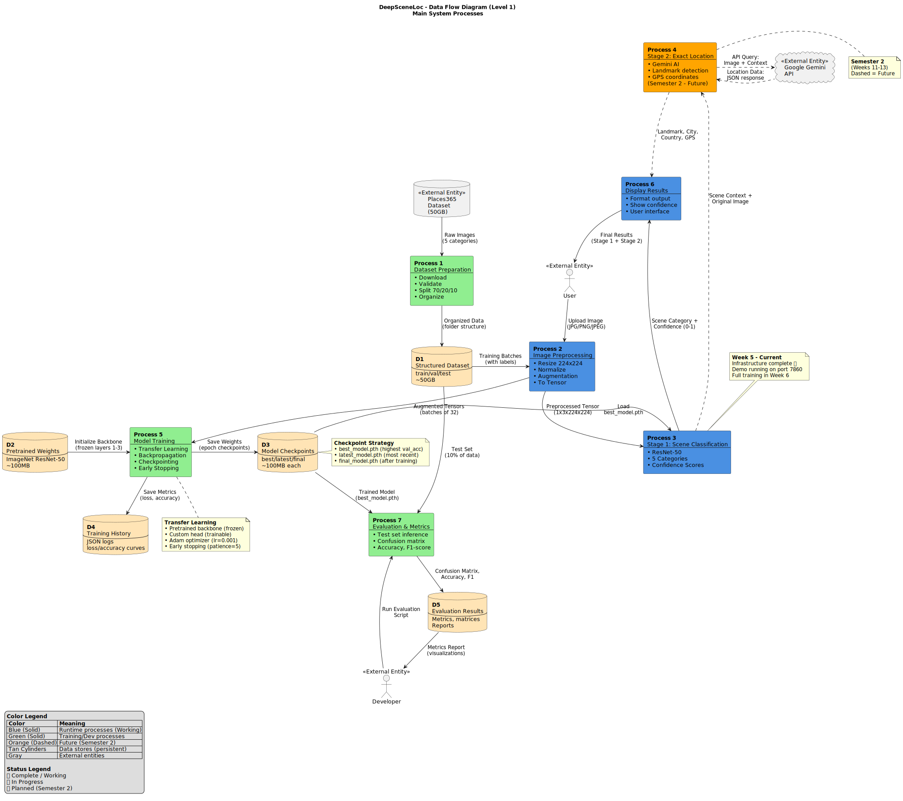

# DeepSceneLoc - Data Flow Diagrams (DFDs)

This folder contains comprehensive Data Flow Diagrams for the DeepSceneLoc project, illustrating the complete system architecture from data preparation through inference and location detection.

---

## 📋 Available Diagrams

### **⭐ DFD Level 1 - PlantUML SVG (Recommended for GitHub)**
**File:** `dfd.svg`  
**Format:** SVG (Scalable Vector Graphic)  
**Purpose:** High-quality, publication-ready diagram for GitHub display

**View on GitHub:**



**Features:**
- ✅ Scalable (no quality loss when zooming)
- ✅ Professional appearance
- ✅ Perfect rendering on GitHub
- ✅ Shows all 7 processes, 5 data stores, complete data flows
- ✅ Color-coded: Blue (runtime), Green (training), Orange (future)
- ✅ Includes legend and annotations

**Best for:** GitHub README, presentations, project reports, Week 5 sign-off

---

### **1. DFD Level 0 - Context Diagram**
**File:** `DFD_LEVEL_0_CONTEXT.md`  
**Format:** Mermaid (renders on GitHub)  
**Purpose:** Highest-level view showing the entire system and external entities

**Shows:**
- System boundary
- External entities (User, Places365, Gemini API, GitHub)
- Major data flows in/out of system

**Best for:** Executive summaries, stakeholder presentations

---

### **2. DFD Level 1 - Main System Processes (Mermaid)**
**File:** `DFD_LEVEL_1_MAIN_PROCESSES.md`  
**Format:** Mermaid (renders on GitHub)  
**Purpose:** Interactive markdown version with detailed annotations

**Shows:**
- 7 main processes (Dataset Prep, Preprocessing, Stage 1, Stage 2, Training, Display, Evaluation)
- 5 data stores (Dataset, Pretrained Weights, Checkpoints, History, Results)
- Complete data flows between processes
- Color-coded by status (Working/In Progress/Future)

**Includes:**
- Detailed process descriptions (inputs, outputs, algorithms)
- Data store specifications (size, contents, status)
- Validation points and decision nodes
- Performance metrics

**Best for:** Technical documentation, project reports, code reviews

---

### **3. DFD Level 2 - Stage 1 Classification (Detailed)**
**File:** `DFD_LEVEL_2_STAGE1_CLASSIFICATION.md`  
**Format:** Mermaid (renders on GitHub)  
**Purpose:** Deep dive into Process 3 (Scene Classification) subprocesses

**Shows:**
- 8 subprocesses with validation steps
- 4 decision nodes (diamond shapes)
- Error handling paths
- Complete inference pipeline

**Includes:**
- Subprocess implementations (code snippets)
- Mathematical operations (softmax equation)
- Error handling matrix
- Performance benchmarks
- Testing recommendations

**Best for:** Developer onboarding, debugging, optimization planning

---

### **4. DFD PlantUML Source File**
**File:** `DFD_PLANTUML.puml`  
**Format:** PlantUML source code  
**Purpose:** Source file for generating the SVG diagram above

**Note:** The `dfd.svg` file was generated from this PlantUML file.

**Features:**
- Clean, publication-ready output
- Customizable colors and styles
- Annotations and legend
- Exportable to PNG, SVG, PDF

**Best for:** Final project report, thesis, conference submissions

---

## 🎨 Diagram Color Coding

All diagrams use consistent color schemes:

| Color | Hex Code | Meaning | Usage |
|-------|----------|---------|-------|
| 🔵 **Blue (Solid)** | `#4A90E2` | Runtime processes | Working features (Semester 1) |
| 🟢 **Green (Solid)** | `#90EE90` | Training/Dev processes | Development infrastructure |
| 🟠 **Orange (Dashed)** | `#FFA500` | Future implementation | Semester 2 planned features |
| 🟤 **Tan** | `#FFE4B5` | Data stores | Persistent storage (databases, files) |
| ⚫ **Gray** | `#D3D3D3` | External entities | Users, APIs, external systems |
| 🔴 **Red** | `#FF6B6B` | Critical errors | Error handling, failures |
| 🟡 **Yellow** | `#FFD700` | Decision nodes | Validation checks, branching |

---

## 🚀 How to View the Diagrams

### **Option 1: View on GitHub (Easiest)**
1. Navigate to this folder on GitHub
2. Click on any `.md` file (e.g., `DFD_LEVEL_1_MAIN_PROCESSES.md`)
3. GitHub automatically renders Mermaid diagrams
4. ✅ **No tools required!**

**Pros:** Instant viewing, no installation  
**Cons:** Limited customization

---

### **Option 2: View in VS Code**
1. Install extension: **Markdown Preview Mermaid Support**
2. Open any `.md` file
3. Press `Ctrl+Shift+V` (Windows/Linux) or `Cmd+Shift+V` (Mac)
4. Diagrams render in preview pane

**Pros:** Offline viewing, integrated with coding  
**Cons:** Requires extension installation

---

### **Option 3: PlantUML (Professional Output)**

#### **Setup:**
1. Install PlantUML:
   - **VS Code Extension:** "PlantUML" by jebbs
   - **CLI:** `npm install -g node-plantuml` or download from [plantuml.com](https://plantuml.com/)

2. Install Graphviz (required for PlantUML):
   - **Windows:** Download from [graphviz.org](https://graphviz.org/download/)
   - **macOS:** `brew install graphviz`
   - **Linux:** `sudo apt install graphviz`

#### **Generate Images:**

**From VS Code:**
1. Open `DFD_PLANTUML.puml`
2. Right-click → "Preview Current Diagram"
3. Right-click preview → "Export Diagram" → Choose format (PNG/SVG/PDF)

**From Command Line:**
```bash
# Generate PNG
plantuml DFD_PLANTUML.puml

# Generate SVG (scalable)
plantuml -tsvg DFD_PLANTUML.puml

# Generate PDF
plantuml -tpdf DFD_PLANTUML.puml
```

**Output:** High-resolution images for reports/presentations

**Pros:** Publication-quality output, fully customizable  
**Cons:** Requires setup and dependencies

---

### **Option 4: Online Mermaid Editor**
1. Go to [mermaid.live](https://mermaid.live/)
2. Copy Mermaid code from any `.md` file (between ` ```mermaid ` and ` ``` `)
3. Paste into editor
4. Download as PNG/SVG

**Pros:** No installation, quick sharing  
**Cons:** Manual copy-paste required

---

## 📐 DFD Symbol Reference

### **Standard DFD Notation**

| Symbol | Shape | Meaning | Example |
|--------|-------|---------|---------|
| **Process** | Rounded Rectangle | Transforms input to output | `[Process 3: Scene Classification]` |
| **Data Store** | Cylinder or Open Rectangle | Persistent storage | `[(D3: Model Checkpoints)]` |
| **External Entity** | Rectangle | Outside system boundary | `[User]`, `[Gemini API]` |
| **Data Flow** | Arrow | Movement of data | `Image →`, `Results →` |
| **Decision Node** | Diamond | Validation/branching | `{Valid Shape?}` |

### **Our Custom Notation**

- **Solid Lines:** Implemented/working features
- **Dashed Lines:** Future planned features (Semester 2)
- **Bold Arrows:** Critical/high-volume data flows
- **Thin Arrows:** Low-volume or occasional flows

---

## 📊 Which Diagram to Use When

| Scenario | Recommended Diagram | Why |
|----------|---------------------|-----|
| **Week 5 Presentation (Today)** | DFD Level 1 | Shows complete system with status indicators |
| **Mentor Sign-off Meeting** | DFD Level 0 + Level 1 | Context + detailed processes |
| **Developer Onboarding** | DFD Level 2 (Stage 1) | Detailed implementation guide |
| **Project Report (Final)** | All 3 levels + PlantUML | Complete documentation |
| **Debugging Stage 1** | DFD Level 2 | Subprocess-level detail with error paths |
| **Planning Semester 2** | DFD Level 1 | Shows future processes (orange/dashed) |
| **Stakeholder Demo** | DFD Level 0 | High-level, non-technical |

---

## 🔄 Diagram Maintenance

### **When to Update:**
- ✅ New process added (e.g., data augmentation module)
- ✅ Data flow changes (e.g., new checkpoint format)
- ✅ Status changes (e.g., Semester 2 features completed)
- ✅ Error handling updated
- ✅ Performance optimizations affecting architecture

### **Update Checklist:**
1. Modify Mermaid code in `.md` files
2. Update PlantUML `.puml` file
3. Regenerate PlantUML images if used in reports
4. Update process descriptions and metrics
5. Commit changes with descriptive message

### **Version Control:**
- All diagram files tracked in Git
- Use semantic commit messages: `docs: Update DFD Level 1 with Semester 2 completion status`

---

## 📚 Additional Resources

### **Mermaid Documentation**
- Official Docs: [mermaid.js.org](https://mermaid.js.org/)
- Flowchart Syntax: [Flowchart Docs](https://mermaid.js.org/syntax/flowchart.html)
- Live Editor: [mermaid.live](https://mermaid.live/)

### **PlantUML Documentation**
- Official Site: [plantuml.com](https://plantuml.com/)
- Activity Diagrams: [Activity Diagram Guide](https://plantuml.com/activity-diagram-beta)
- Deployment Diagrams: [Deployment Guide](https://plantuml.com/deployment-diagram)

### **DFD Best Practices**
- [Data Flow Diagram Guidelines (Wikipedia)](https://en.wikipedia.org/wiki/Data-flow_diagram)
- [DFD Notation Standards](https://www.lucidchart.com/pages/data-flow-diagram)

---

## 🎯 Quick Start Guide

**For Today's Meeting (February 27, 2026):**

1. ✅ Open `DFD_LEVEL_1_MAIN_PROCESSES.md` on GitHub
2. ✅ Show mentor the complete system flow
3. ✅ Point out blue (working) vs orange (future) processes
4. ✅ Highlight Process 3 (Stage 1) as Week 5 deliverable
5. ✅ Explain data stores D1-D5 status

**Key Talking Points:**
- "Blue processes are working (Weeks 1-5 complete)"
- "Orange dashed = Semester 2 (Weeks 11-13)"
- "All data flows tested with demo app running on port 7860"
- "Level 2 diagram available for technical deep-dive if needed"

---

## 🛠️ Troubleshooting

### **Mermaid Not Rendering on GitHub**
- Ensure ` ```mermaid ` syntax is correct (lowercase, triple backticks)
- Check for syntax errors (missing arrows, unclosed brackets)
- Try viewing on [mermaid.live](https://mermaid.live/) to debug

### **PlantUML "Graphviz Not Found"**
- Install Graphviz: [graphviz.org/download](https://graphviz.org/download/)
- Add Graphviz to system PATH
- Restart VS Code after installation

### **Diagrams Too Large/Small**
- **Mermaid:** Add `%%{init: {'theme':'base', 'themeVariables': {'fontSize':'16px'}}}%%` at top
- **PlantUML:** Add `scale 1.5` or `scale 0.75` to `.puml` file

### **Colors Not Showing**
- Ensure you're using GitHub-flavored Markdown
- Some preview tools don't support styling (use PlantUML for guaranteed colors)

---

## 📝 Credits

**Created by:** DeepSceneLoc Team  
**Date:** February 27, 2026  
**Project:** Visual Scene Understanding for Image-Based Location Estimation

**Contributors:**
- Krishan Yadav (Technical Lead) - System architecture
- Aditi Sah (Data Lead) - Data flow design
- Anuj Kondawar (Preprocessing Lead) - Process definitions
- Jensi Paneliya (Documentation Lead) - Diagram documentation

---

## 📄 License

These diagrams are part of the DeepSceneLoc project and are subject to the project's proprietary license. See `LICENSE` file in project root.

**Internal Use Only** - Do not distribute outside the project team without permission.

---

**Last Updated:** February 27, 2026  
**Status:** Week 5 - Baseline Model Infrastructure Complete ✅
